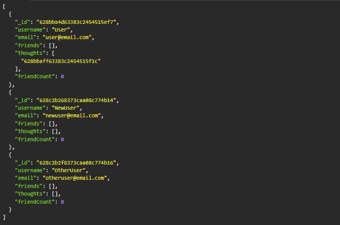
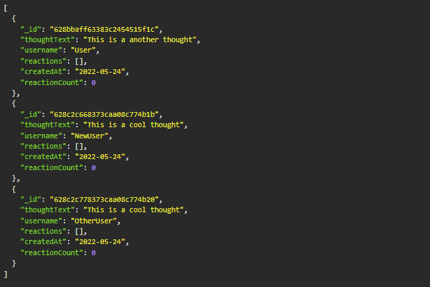
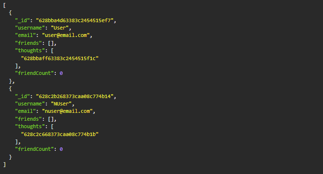
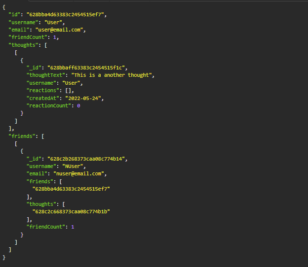
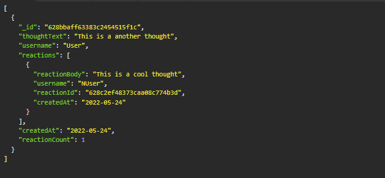

# social-network-API

## Description

This project handles the back end of a social media platform. It uses MongoDB in order to store users and thoughts. Each user can have attributed thoughts as well as a friends list. You can read, create, update, and delete any user or thought from the database. You may also add and remove users from friends lists. Each thought also allows for reaction, where any user can add a reaction to a thought. These will be stored in the thought. There are routes for adding and removing reactions as well. This should handle a lot of basic tasks that a social media platform should have.

## Table of Contents

* [Technologies](#technologies)
* [Installation](#installation)
* [Usage](#usage)
* [Questions](#questions)
* [License](#license)

## Technologies

| Technology | Link |
| -------- | ------|
| HTML |   |
| Javascript |    |
| Node.js | https://nodejs.org/en/ |
| npm | https://www.npmjs.com/ |

## Installation

In order to use this program just clone the repository and run `npm install`. After that make sure mongoDB is running and you can optionally run `npm run seed` for 2 users and a 1 thought, or just don't do it at all and start your db from scratch. To run type in `npm start` and the server will start and you can start making calls to the server.

## Usage

Usage Video Link: https://www.youtube.com/watch?v=xhUziihN_vM

When you first start up the project if you haven't ran the seed file then you will not have anything in the database. We can see this by making get requests to /api/users or /api/thoughts So the first thing to do is to make some users. Send post requests to /api/users in order to create users with the body being a username and an email. Here is the database after adding a few users:  

  

Now that we have a few users we can add some thoughts to the users. Send a post request to /api/thoughts with the body being thoughtText, username, and userid. The username will be the user making the thought, the userid will be the user id of that user which can be found by a get route to /api/users and getting that user's id. The thought text is just the text that you want to fill the thought with. The thought is similar to a post on other platforms. Here is the database after adding a few thoughts:  

  

Now we have users and thoughts in our database, we can update these users or thoughts by sending put requests to /api/users/:userId or /api/thoughts/:thoughtId with the userId being the id for that user and thoughtId being the id for that thought. We can also delete users or thoughts by sending delete requests to the same routes. After playing around with the users we can from the picture we had before to something like this:  

  

As you might notice from this picture we also have thoughts in the thought array, we can also add friends to this list. To add a friend send a put request to /api/users/:userId/friends/:friendId. Doing this will add the user correlating to the friend id to the user correlating to the user id. From here we can also view individual users by making a get request to /api/user/:userId. Here is one User after having a friend added:  

  

Friends can be removed from friends lists as well. Just use the same routes as adding friends but send a delete request instead to remove users from friends lists. The last thing we can do is add reactions to posts. Send a put request to /api/thoughts/:thoughtId/reactions to add a reaction. The put request body should be formatted as reactionBody and username, with reactionBody being the text in the reaction and the username being the user reacting. Here is a thought after adding a reaction to it:  

  

Lastly we can also delete reactions, the same route is used except we add :reactionId to theend with it correlating to the reactionId of the reaction. That would make our route /api/thoughts/:thoughtId/reactions/:reactionId. Sending a delete request here would delete the reaction. That is all we can do with this social media API.

## Questions
If you have any questions you can reach me at:  
Github: cmwschroeder  
Github link: https://github.com/cmwschroeder  
Email: cmwschroeder@gmail.com

## License

Licensed under the [MIT License](LICENSE)